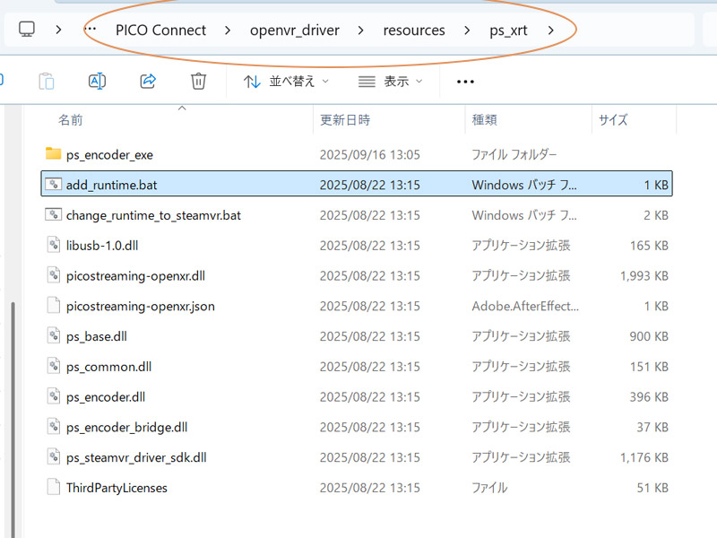
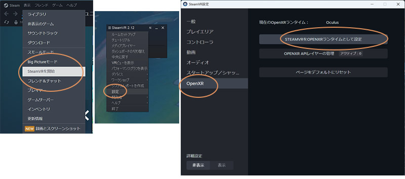

# OpenXRManager (DX12) — README

DirectX 12 向けの OpenXR ヘルパークラス **OpenXRManager** の簡易的な使い方まとめです。  
初期化・毎フレーム更新・コントローラー入力/振動・描画手順・終了までを最小構成で記載しています。

---

## 目次
- [前提](#前提)
- [使い方の流れ](#使い方の流れ)
  - [初期化](#初期化)
  - [毎フレーム（必須）](#毎フレーム必須)
  - [コントローラー情報の取得](#コントローラー情報の取得)
  - [コントローラー API 一覧](#コントローラー-api-一覧)
  - [コントローラー振動](#コントローラー振動)
  - [ヘッドマウント情報](#ヘッドマウント情報)
  - [描画の手順](#描画の手順)
  - [終了処理](#終了処理)

---

## 前提

- C++ / DirectX 12
- OpenXR SDK（ヘッダーとライブラリ）
- OpenXR ランタイム（Quest用/Pico用 など）

#### 追加のインクルードパス
  OpenXR-SDK\include;

#### 追加のライブラリディレクトリ
  OpenXR-SDK\Lib\loader\Debug;  
  OpenXR-SDK\Lib\loader\Release;
  
---

## 使い方の流れ

### 初期化

```cpp
// 使い方

OpenXRManager* XR_Manager;

// ＜初期化＞
XR_Manager = new OpenXRManager();
XR_Manager->Initialize(dx12Device.Get(), commandQueue.Get());
```


### 毎フレーム（必須）

```cpp
// ＜毎フレーム　＊必須＞
XR_Manager->UpdateSessionState(); // OpenXR の情報更新
```


### コントローラー情報の取得

```cpp
// ＜コントローラー情報取得＞
if (XR_Manager->controllersReady) {

    const float deadzone = 0.05f; // デッドゾーン（微細な振動とかは取らない）
    XrVector2f stick = XR_Manager->controller.GetValue_Right_Stick(deadzone); // 右スティック xy

    bool flg = XR_Manager->controller.OnPush_Left_X(); // 左 Xボタン

    XrPosef rightControllerPose = XR_Manager->controller.GetPose_RightController(); // 右コントローラーのポーズ
    // rightControllerPose.position  // x, y, z
    // rightControllerPose.rotation  // x, y, z, w（クォータニオン）
}
```


### コントローラー API 一覧

```cpp
// 位置・姿勢
XrPosef GetPose_LeftController()  const;
XrPosef GetPose_RightController() const;

// スティック（オプションでデッドゾーン指定可）
XrVector2f GetValue_Left_Stick()              const;
XrVector2f GetValue_Right_Stick()             const;
XrVector2f GetValue_Left_Stick(float dz)      const;
XrVector2f GetValue_Right_Stick(float dz)     const;

// トリガー値（アナログ 0..1）
float GetValue_Left_SelectTrigger()  const;  // 人差し指
float GetValue_Right_SelectTrigger() const;
float GetValue_Left_SqueezeTrigger()  const; // 握り
float GetValue_Right_SqueezeTrigger() const;

// 押下イベント（押した“瞬間”）
bool OnPushSelectTrigger(bool leftHand) const;
bool OnPushSqueezeTrigger(bool leftHand) const;
bool OnPushA(bool leftHand) const;
bool OnPushB(bool leftHand) const;
bool OnPushX(bool leftHand) const;
bool OnPushY(bool leftHand) const;
bool OnPushMenu(bool leftHand) const;
bool OnPushStick(bool leftHand) const;

// 利き手別ショートカット
bool OnPush_Left_SelectTrigger()   const;
bool OnPush_Right_SelectTrigger()  const;
bool OnPush_Left_SqueezeTrigger()  const;
bool OnPush_Right_SqueezeTrigger() const;
bool OnPush_Left_A()  const;  bool OnPush_Right_A()  const;
bool OnPush_Left_B()  const;  bool OnPush_Right_B()  const;
bool OnPush_Left_X()  const;  bool OnPush_Right_X()  const;
bool OnPush_Left_Y()  const;  bool OnPush_Right_Y()  const;
bool OnPush_Left_Menu()  const; bool OnPush_Right_Menu() const;
bool OnPush_Left_Stick() const;  bool OnPush_Right_Stick() const;

// ハプティクス（振動）
bool ApplyHaptics(bool leftHand, float amplitude, float seconds, float frequencyHz = 0.0f);

// 現在の左右状態
const State& Left()  const { return stateLeft; }
const State& Right() const { return stateRight; }
```

`State` 構造体：

```cpp
struct State {
    bool  isActive = false;         // その手の入力が現在有効か
    bool  triggerClick = false;     // 人差し指トリガーのクリック（デジタル）
    float triggerValue = 0.0f;      // 人差し指トリガーのアナログ値(0..1)
    bool  squeezeClick = false;     // 中指ボタン つかむ(クリック)
    float squeezeValue = 0.0f;      // 中指ボタン つかむ(アナログ値 0..1)
    XrVector2f stickValue{ 0,0 };   // スティック
    bool  stickClick = false;       // スティック押し込み
    bool  menu = false;             // メニューボタン

    bool  buttonA = false;          // Aボタン
    bool  buttonB = false;          // Bボタン
    bool  buttonX = false;          // Xボタン
    bool  buttonY = false;          // Yボタン

    XrPosef aimPose{};              // レイ用途の姿勢
    XrPosef gripPose{};             // コントローラ実位置
    bool  hasAimPose = false;
    bool  hasGripPose = false;
};
```


### コントローラー振動

```cpp
// ＜コントローラー振動＞
XR_Manager->controller.ApplyHaptics(
    /*leftHand=*/true,
    /*amplitude=*/0.5f,
    /*seconds=*/0.5f,
    /*frequencyHz=*/0.0f // 0.0 でランタイム任せにできる
);
```


### ヘッドマウント情報

```cpp
// ＜ヘッドマウント情報＞
int viewNum = XR_Manager->xr_viewCount; // ビューの数（両目なので = 2）
```

---

### 描画の手順

- ＊フレーム開始
```cpp
XrTime predictedDisplayTime; // 描画予定時間

// フレーム開始（ここで描画予定時間を受け取る）
XR_Manager->BeginFrame(predictedDisplayTime);
```

```cpp
// 目ごとの行列格納用
struct EyeMatrix {
    XMMATRIX viewMat; // ビュー行列
    XMMATRIX projMat; // プロジェクション行列
    XrView   xrView;  // OpenXR の生データ
};

std::vector<OpenXRManager::EyeMatrix> eyesData; // ヘッドマウントの両目のカメラ行列（DX12 向け）
float nearZ = 0.01f; // 近クリップ面
float farZ  = 100.0f; // 遠クリップ面

// VR の両目位置のカメラ行列を取得
XR_Manager->GetEyeMatrix(predictedDisplayTime, nearZ, farZ, eyesData);

// ---- ここから各ビュー（目）に対する描画 ---- 右目、左目の描画です
for (uint32_t viewIdx = 0; viewIdx < eyesData.size(); ++viewIdx) {

    OpenXRManager::EyeDirectTarget tgt{}; // VRヘッドマウントへの描画先（RTV/DSV など）
    XR_Manager->GetSwapchainDrawTarget(commandList.Get(), viewIdx, tgt); // スワップチェーンの描画先を取得

    // DX12 の描画設定
    const FLOAT clearColor[4] = {0, 0, 0, 1};
    commandList->ClearRenderTargetView(tgt.rtv, clearColor, 0, nullptr); // レンダーターゲットをクリア
    commandList->ClearDepthStencilView(tgt.dsv, D3D12_CLEAR_FLAG_DEPTH, 1.0f, 0, 0, nullptr); // 深度クリア
    commandList->OMSetRenderTargets(1, &tgt.rtv, FALSE, &tgt.dsv); // 出力先セット

    //＊ここで DX12 コマンドで実際の描画を行う（eyesData[viewIdx].viewMat / projMat を使用）

	//＊すでに描画済みのリソースがある場合は、描画先（tgt.rtv / tgt.dsv）にコピーしてください
	// 例：commandList->CopyResource(tgt.rtv, renderedResource);
	// コピー先とサイズが違う場合は、シェーダーなどでコピーしてください

    // VRヘッドマウントのスワップチェーンへの描画終了
    XR_Manager->FinishSwapchainDrawTarget(commandList.Get(), viewIdx);
}
```

- コマンドの実行
```cpp
// ＊コマンドを閉じて実行し、ターゲットへの描画を完了させる
commandList->Close();

// → コマンドキュー、フェンスで「完全に描画が完了したか」を確認します
```

- ＊フレーム終了
```cpp
// フレーム終了
XR_Manager->EndFrame_WithProjection(
    eyesData,            // 取得した両目のカメラ行列
    nearZ, farZ,         // カメラのニア・ファー
    predictedDisplayTime // 実際に描画した情報をヘッドマウントへ渡す
);
```


---

### アプリケーション終了処理

```cpp
// ＊アプリケーション終了時
XR_Manager->OnDestroy(); // 破棄
delete XR_Manager;
XR_Manager = nullptr;
```

---

## このコードの動作確認 状況

- Meta Quest 3 （問題なし）
- Meta Quest 2 （問題なし）
Meta Quest Linkを使用してPCに接続しています
  
- Pico 4 （Pico 専用OpenXRランタイムなら問題なし。SteamVR経由は、NG）
Pico Connectを使用してPCに接続しています

---

## OpenXRランタイムの切り替え方

### [Meta Quest]

Meta Quest Linkから、Quest用OpenXRを有効にしてください。


### [Pico 4]

Pico Connectからでは、Pico専用OpenXRを有効にできません。

Pico Connectをインストールした以下のフォルダを開きます。
PICO Connect\openvr_driver\resources\ps_xrt\

ここにある
	add_runtime.bat

を、右クリックして「管理者権限で実行」。
yesを入力してエンターすると、Pico専用OpenXRを有効にできます。



### [SteamVR]（このコードの動作確認はできていません）

SteamVRを起動して、小さなVR用ウインドウの設定から
SteamVR用OpenXRランタイムを有効にしてください。




